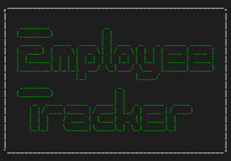

# phelps-employee-tracker-challenge

  

  ## Description

  This application allows users to view and manage the departments, roles, and employees in their company.

  ## Table of Contents

  - [Installation](#installation)
  - [Usage](#usage)
  - [Demonstration](#demonstration)
  - [Screenshot](#screenshot)
  - [Questions](#questions)
  

  ## Installation

  Make sure to initialize npm with by running "npm init -y" in your terminal, and then install the needed packages by also running "npm i" in your terminal. Start the application by running "npm start" in your terminal.

  ## Usage

  Select from the opening prompts on the main menu, then answer the queries to view, add, or remove data related to a company's departments, roles, and/or employees. Select the "Quit" option on the main menu to exit the application.

  ## Demonstration

  [Video demonstration of the application](https://drive.google.com/file/d/1-5f5dwUV9d5rfRzmQq8zg9UXnsrnVkMj/view)
  
  ## Screenshot   
  
  

  ## Questions

  - GitHub: [sora64](https://github.com/sora64/)

  - Email: If you have any other questions, please reach me at [phelpsa64@gmail.com](mailto:phelpsa64@gmail.com).